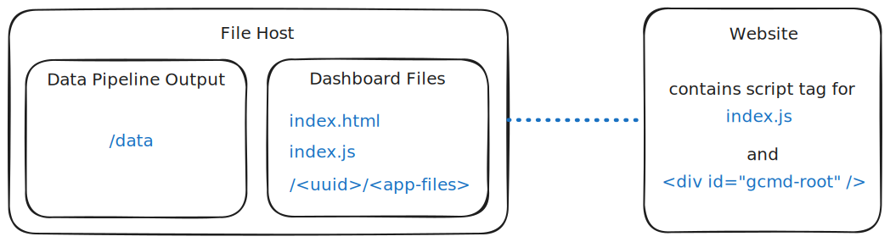

# Greenville Connects Mobility Dashboard

This repository contains the frontend and data pipeline code for the dashboard.

Live website: TBA \
Preview website: https://gc-mobility-dashboard.pages.dev/ \
Example: https://jsfiddle.net/Jack_Buehner/rxj6amt5/latest

## Project structure

This project is organized into two main directories:

- `frontend/`: Contains the frontend code built with Vite and React.
- `data-pipeline/`: Contains the data pipeline code responsible for processing and preparing data for the dashboard.

This project is designed to allow for the data pipeline outputs and the frontend to be hosted separately if desired. Additionally, the frontend can be injected into an existing webpage.

Example setup:

## Building the frontend

To build the frontend, navigate to the `frontend` directory and follow the instructions in the [frontend/README.md](frontend/README.md) file.

## Running the data pipeline

To run the data pipeline, navigate to the `data-pipeline` directory and follow the instructions in the [data-pipeline/README.md](data-pipeline/README.md) file.

The data pipeline processes raw data and generates the necessary outputs for the dashboard. It is a complicated process that can take a significant amount of time to run, depending on the data and the computational resources available.
Be sure to carefully read the instructions and explainations in the data pipeline README before running the pipeline.

## Releasing assets to S3

1. Sign in to the [AWS Console](https://console.aws.amazon.com/console/home).

2. If you do not already have an S3 bucket set up for hosting the assets, create one via the AWS Console.

3. Upload `index.html` and `index.js` from the `frontend/dist` directory to the root of your S3 bucket.\
   \
   When uploading, set the [Cache-Control](https://developer.mozilla.org/en-US/docs/Web/HTTP/Reference/Headers/Cache-Control) headers for these files to `no-cache` to prevent caching issues:

   1. Expand the **Properties** secton.
   2. Under **Metadata**, click **Add metadata**:
      - For **Type**, select **System defined**.
      - For **Key**, select **Cache-Control** from the dropdown.
      - For **Value**, enter `no-cache`.

   > [!CAUTION]
   > Failure to set the correct cache-control headers for these files may result in broken functionality for users that cannot be easily resolved without clearing their browser cache.
   > **Do not forget to set these headers.**

4. Upload the folder from `frontend/dist/<uuid>` (the folder with a randomly generated letters and numbers) to your S3 bucket. This folder contains all the static assets for the frontend. Keep the same folder structure when uploading to S3; `index.html` and `index.js` will look for that specific folder.

5. If you bucket does not already have a `data` folder, create one.

6. Upload the contents of the `data-pipeline/data/__public` directory to the `data` folder in your S3 bucket. Do not include the `__public` folder itself; only upload its contents.

Note: This folder structure can be replicated on any static file hosting service, not just S3.
